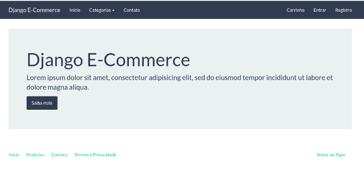

# Django E-commerce
> A prototype for an e-commerce application using Django. 

![PyPi][python-image]
![PyPi][status-image]
![Dockbit][deploy-image]
![Wercker][build-image]

This application was used to understand the integration with PagSeguro and GerenciaNet Payment Gateway.

## Technologies utilized
* Python 3.5+
* Django 1.11
* PostgreSQL 9.5+

## Public area



## Installation

Any Operating System:

```sh
mkvirtualenv djangoecommerce -p python3

pip install -r requeriments.txt

python makemigrations

python migrate

python manage.py createsuperuser

python manage.py runserver

access http://localhost:8000
```

## Release History

* 0.2.1
    * CHANGE: Update README
* 0.2.0
    * The first proper release
* 0.1.3
	* ADD: Create the app `checkout`
* 0.1.2
	* ADD: Create the app `accounts`
* 0.1.1
    * ADD: Create the app `catalog`
* 0.1.0
    * ADD: Create the app `core` 
* 0.0.1
    * Work in progress

## Meta

Diemesleno Souza Carvalho – [@diemesleno](https://twitter.com/diemesleno) – diemesleno@gmail.com

Distributed under the ![AUR][gpl-image] license. 

[https://github.com/diemeslen0/simetric](https://github.com/diemeslen0/)

[python-image]: https://img.shields.io/pypi/pyversions/Django.svg?style=flat-square
[gpl-image]: https://img.shields.io/aur/license/yaourt.svg?style=flat-square
[status-image]: https://img.shields.io/pypi/status/Django.svg?style=flat-square
[build-image]: https://img.shields.io/wercker/ci/wercker/docs.svg
[deploy-image]: https://img.shields.io/dockbit/DockbitStatus/health.svg?token=TvavttxFHJ4qhnKstDxrvBXM&style=flat-square
